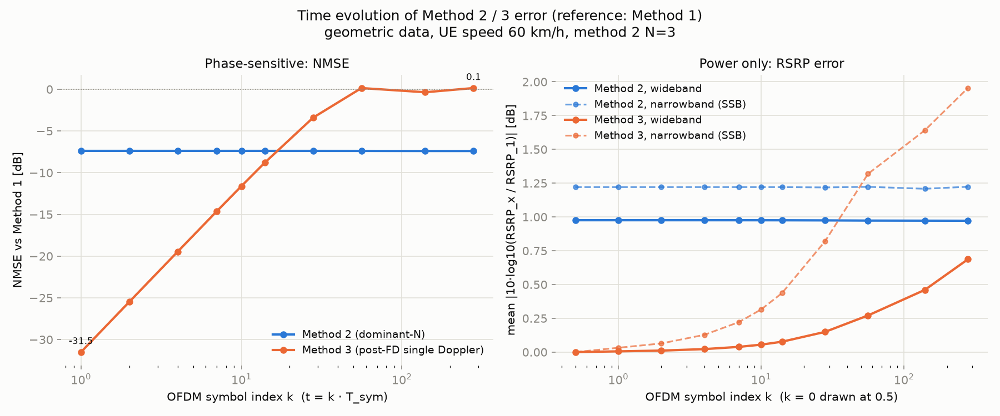
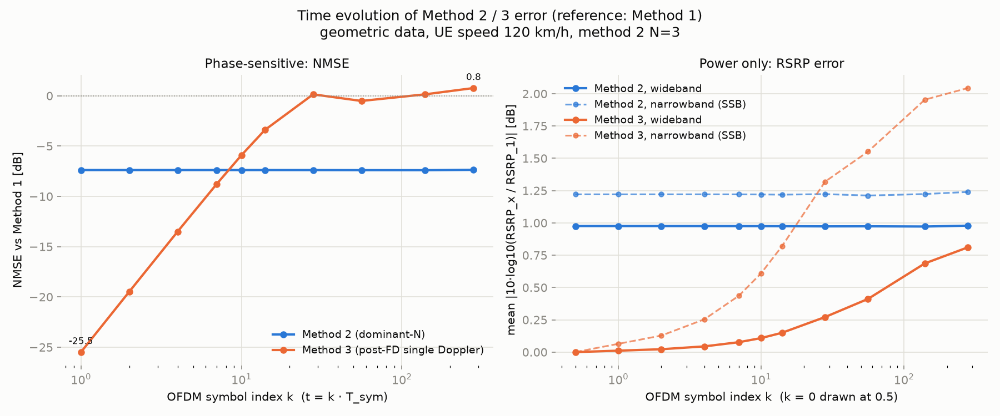
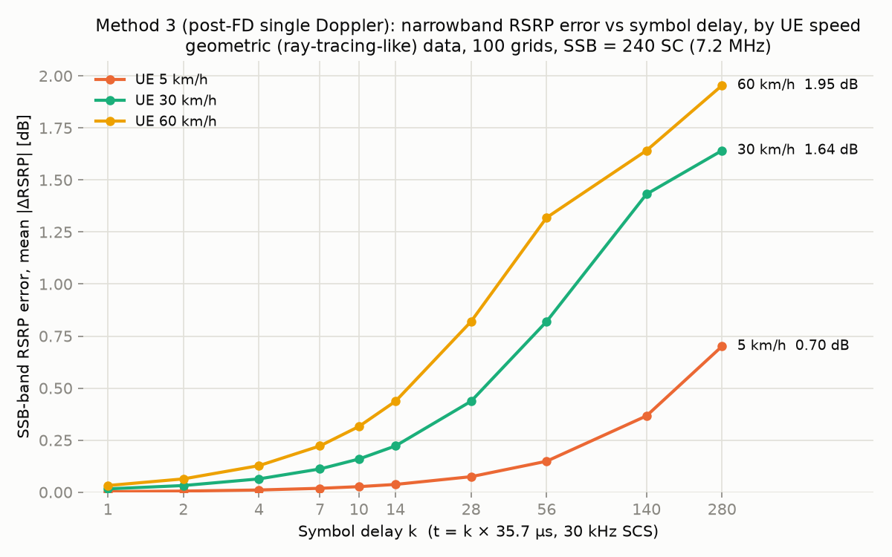
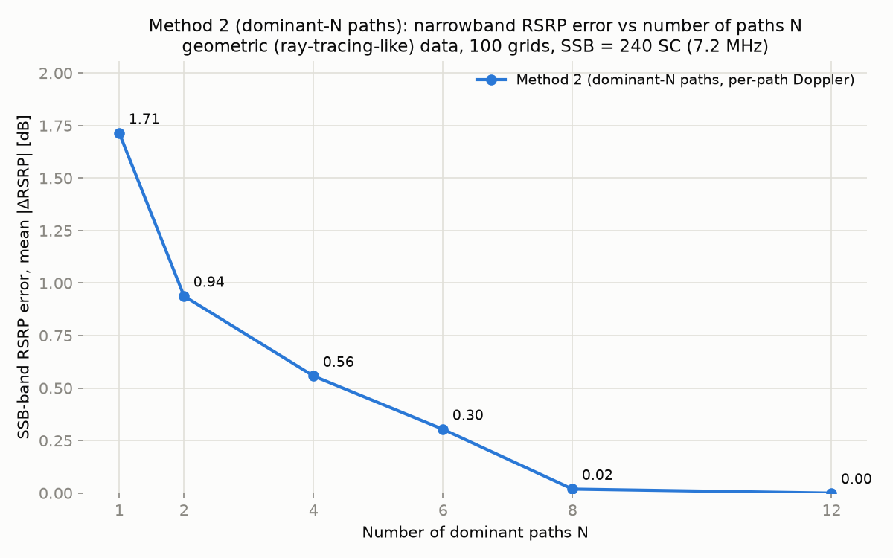
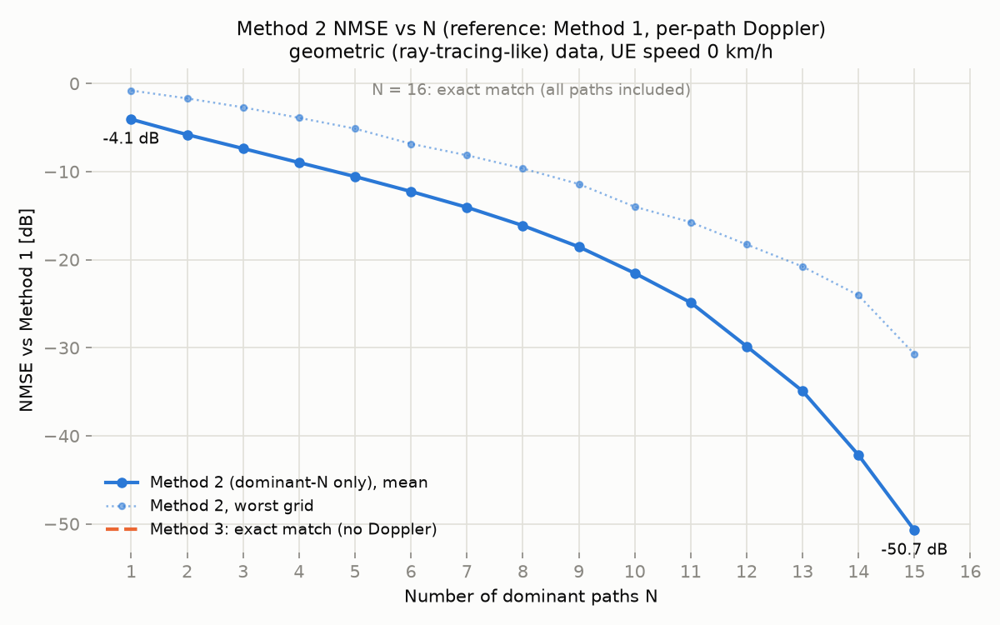
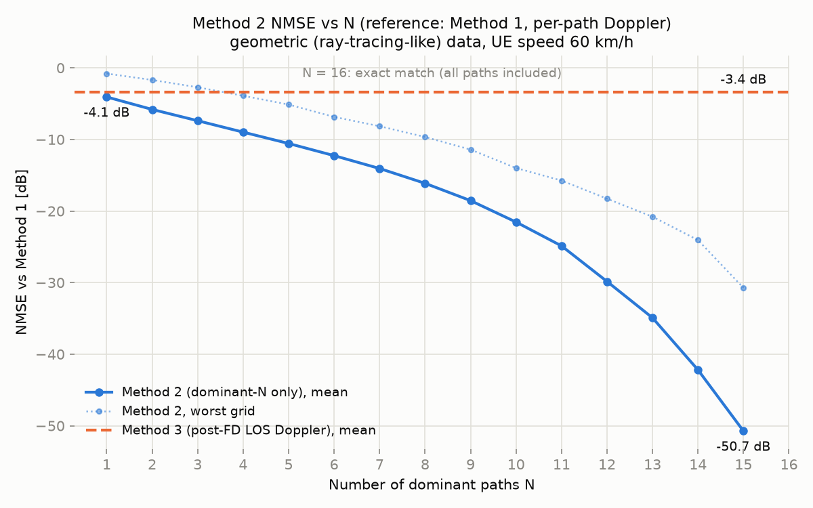
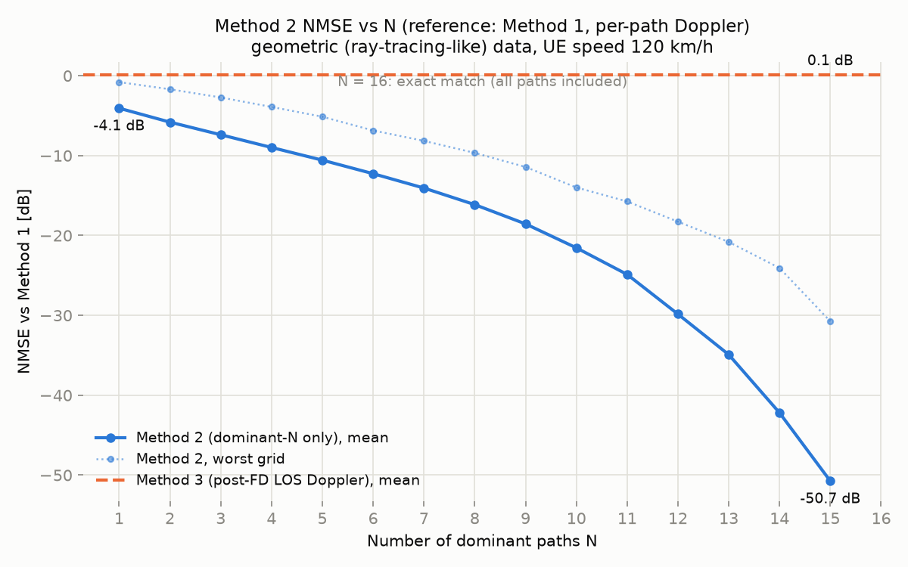

# Doppler 방식 비교 결과 (방식 1 기준 NMSE)

- 실험 일자: 2026-09-19, CI run [35416261866](https://github.com/csungq-eng/doppler_sim/actions/runs/35416261866)
- 입력 데이터 두 종류 (모두 per-antenna-pair 모드, grid 100개, BS 64 × UE 4,
  path 최대 16개, seed 2026):
  - **random**: AoA 전방위 uniform, pair마다 독립인 path 집합 (기하 정보 없음),
    path 수 3~16 uniform
  - **geometric**: 기지국·grid·산란체·차폐 블록 위치에서 계산한 LOS + 단일 반사 path
    (실제 레이트레이싱 모사). 차폐 블록 2개 때문에 **100개 grid 중 60개가 LOS,
    40개가 NLOS**(블록 뒤에 뭉쳐 분포). LOS grid는 LOS AoA가 기지국 방향과 일치하고
    K-factor 평균 4.8 dB(LOS 전력 72%). 산란체 30개를 전 grid 공유, path 수 7~16
    (평균 11.3). pair 간에는 element 위치에 따른 tau 차이만 존재.
    정의는 [README](../README.md#생성-시나리오) 참조.
- OFDM: fc 3.5 GHz, SCS 30 kHz(273 RB, 100 MHz), subcarrier 3276개, T_sym = 35.7 µs → H는 64 × 4 × 3276
- 단말 이동성: 방향 45°, snapshot t = 1 ms(≈ 28심볼), 속도 0 / 60 / 120 km/h
  (최대 Doppler: 0 / 194.6 / 389.2 Hz). t의 의미와 심볼 단위 결과는 "방식 3의
  구조적 한계" 절 참조.
- 지표 (모두 방식 1 = 모든 path에 path별 Doppler 적용을 reference로):
  - **NMSE = ‖H_x − H₁‖² / ‖H₁‖²** — 위상 포함 오차, 낮을수록 좋음. 표 값은 grid 평균(dB)
  - **RSRP 오차** = (bs, ue) pair마다 subcarrier 평균 |H|²의 비 `|10·log10(RSRP_x / RSRP₁)|`
    (pair 평균, dB). 전대역(3276 SC)과 협대역(중앙 240 SC = SSB 20 RB, 7.2 MHz) 두 가지

## 방식 요약

| 방식 | 내용 |
|---|---|
| 1 (기준) | 각 path에 Doppler 적용 후 주파수 채널 변환 |
| 2 | power 상위 dominant N개 path만으로 채널 구성(나머지 제외) + path별 Doppler |
| 3 | Doppler 없이 주파수 변환 후, LOS 방향(grid→기지국 방위각을 AoA로 가정) 단일 Doppler로 전체 행렬 위상 회전 |

## 1. 전체 grid 평균

| N (방식 2) | random v=0 | random v=60 | random v=120 | geometric v=0 | geometric v=60 | geometric v=120 |
|---|---|---|---|---|---|---|
| 1 | −1.67 | −1.67 | −1.67 | −4.06 | −4.06 | −4.06 |
| 3 | −4.54 | −4.54 | −4.54 | −7.38 | −7.39 | −7.39 |
| 5 | −7.28 | −7.28 | −7.28 | −10.56 | −10.57 | −10.57 |
| 9 | −13.35 | −13.35 | −13.35 | −18.54 | −18.55 | −18.55 |
| 12 | −19.69 | −19.70 | −19.70 | −29.84 | −29.84 | −29.84 |
| 15 | −32.31 | −32.30 | −32.30 | −50.73 | −50.74 | −50.75 |
| 16 | 정확히 일치* | 정확히 일치* | 정확히 일치* | 정확히 일치* | 정확히 일치* | 정확히 일치* |
| **방식 3** | **정확히 일치** | **+0.55** | **+3.02** | **정확히 일치** | **−3.39** | **+0.15** |

\* N = 16은 최대 path 수라 방식 2 == 방식 1 (−318 dB = 수치 오차 수준).
방식 3의 "정확히 일치"는 v = 0이면 Doppler 회전이 없어 방식 1과 같아지기 때문.
전체 N은 `img/nmse_sweep_*.csv` 참조.

## 2. geometric 데이터: LOS grid / NLOS grid 분리

원본: [img/los_split_geo_v60.md](img/los_split_geo_v60.md),
[v120](img/los_split_geo_v120.md), [v0](img/los_split_geo_v0.md)

| N (방식 2) | LOS grid (60개) | NLOS grid (40개) |
|---|---|---|
| 1 | −5.56 | −2.49 |
| 2 | −7.74 | −3.93 |
| 3 | −9.42 | −5.45 |
| 5 | −12.73 | −8.56 |
| 9 | −19.78 | −17.17 |
| 12 | −29.22 | −30.97 |
| **방식 3, v = 60 km/h** | **−7.13** | **−0.68** |
| **방식 3, v = 120 km/h** | **−3.97** | **+2.97** |

(방식 2는 속도 무관이라 60 km/h 값만 표기)

NLOS grid 중 방식 3이 방식 2의 N = 1(최강 path 하나)보다 나쁜 grid:
60 km/h **26 / 40**, 120 km/h **36 / 40**.

## 3. RSRP 관점 (전력만 비교) — 심볼 index에 따른 시간 진행

NMSE는 위상까지 보는 지표라 방식 3에 가혹하다. 전력만 보는 RSRP 오차로 같은 비교를
하면 그림이 크게 달라진다. C++ `--symbol-list` 모드로 geometric 데이터(100 grid)에서
k번째 심볼(t = k·T_sym, T_sym = 35.7 µs)의 방식 2(N = 3)/방식 3 오차를 계산했다.
원본: [img/symbol_sweep_geo_v60.csv](img/symbol_sweep_geo_v60.csv),
[v120](img/symbol_sweep_geo_v120.csv), [v60 재정규화](img/symbol_sweep_geo_v60_renorm.csv)

**60 km/h, grid 평균 [dB]**

| 심볼 k | 1 | 4 | 7 | 14 | 28 | 56 | 140 | 280 |
|---|---|---|---|---|---|---|---|---|
| t [ms] | 0.04 | 0.14 | 0.25 | 0.50 | 1.00 | 2.00 | 5.00 | 9.99 |
| NMSE 방식 2 (N=3) | −7.38 | −7.38 | −7.38 | −7.38 | −7.39 | −7.39 | −7.40 | −7.40 |
| NMSE 방식 3 | −31.50 | −19.48 | −14.65 | −8.79 | −3.40 | 0.14 | −0.36 | 0.15 |
| RSRP 전대역 방식 2 (N=3) | 0.98 | 0.98 | 0.98 | 0.98 | 0.97 | 0.97 | 0.97 | 0.97 |
| RSRP 전대역 방식 2 재정규화 | 0.28 | 0.28 | 0.28 | 0.28 | 0.28 | 0.28 | 0.27 | 0.27 |
| RSRP 전대역 방식 3 | 0.01 | 0.02 | 0.04 | 0.08 | 0.15 | 0.27 | 0.46 | 0.69 |
| RSRP 협대역 방식 2 (N=3) | 1.22 | 1.22 | 1.22 | 1.22 | 1.22 | 1.22 | 1.21 | 1.22 |
| RSRP 협대역 방식 2 재정규화 | 0.92 | 0.92 | 0.93 | 0.93 | 0.92 | 0.92 | 0.91 | 0.91 |
| RSRP 협대역 방식 3 | 0.03 | 0.13 | 0.22 | 0.44 | 0.82 | 1.32 | 1.64 | 1.95 |

**120 km/h, 방식 3만 [dB]** (방식 2는 속도 무관)

| 심볼 k | 1 | 4 | 7 | 14 | 28 | 56 | 140 | 280 |
|---|---|---|---|---|---|---|---|---|
| NMSE 방식 3 | −25.48 | −13.51 | −8.79 | −3.40 | 0.14 | −0.51 | 0.15 | 0.77 |
| RSRP 전대역 방식 3 | 0.01 | 0.04 | 0.08 | 0.15 | 0.27 | 0.41 | 0.69 | 0.81 |
| RSRP 협대역 방식 3 | 0.06 | 0.25 | 0.44 | 0.82 | 1.32 | 1.55 | 1.95 | 2.04 |

| 60 km/h | 120 km/h |
|---|---|
|  |  |

### 3.1 방식 2: path 수 N에 따른 RSRP 오차

geometric 데이터, 60 km/h, t = 1 ms, 100 grid 평균 [dB]. 전체 N과 grid별 원자료는
[img/nmse_sweep_geo_v60.csv](img/nmse_sweep_geo_v60.csv),
[재정규화](img/nmse_sweep_geo_v60_renorm.csv),
[LOS/NLOS 분리](img/los_split_geo_v60.md) 참조.

| N (방식 2) | NMSE | 전대역 | 이론값* | 전대역 재정규화 | 협대역 | 협대역 재정규화 | 전대역 LOS/NLOS | 협대역 LOS/NLOS | random 전대역 |
|---|---|---|---|---|---|---|---|---|---|
| 1 | −4.06 | 2.47 | 2.43 | 0.58 | 2.59 | 1.46 | 1.59 / 3.81 | 1.92 / 3.59 | 5.23 |
| 2 | −5.81 | 1.50 | 1.43 | 0.36 | 1.71 | 1.12 | 0.95 / 2.33 | 1.25 / 2.41 | 3.19 |
| 3 | −7.39 | 0.97 | 0.92 | 0.28 | 1.22 | 0.92 | 0.64 / 1.47 | 0.95 / 1.62 | 2.09 |
| 4 | −8.98 | 0.67 | 0.61 | 0.24 | 0.94 | 0.79 | 0.47 / 0.97 | 0.76 / 1.21 | 1.44 |
| 5 | −10.57 | 0.46 | 0.41 | 0.19 | 0.73 | 0.65 | 0.33 / 0.65 | 0.59 / 0.94 | 1.02 |
| 7 | −14.06 | 0.20 | 0.18 | 0.10 | 0.42 | 0.40 | 0.15 / 0.28 | 0.32 / 0.58 | 0.51 |
| 9 | −18.55 | 0.08 | 0.06 | 0.05 | 0.20 | 0.20 | 0.07 / 0.10 | 0.18 / 0.24 | 0.25 |
| 12 | −29.84 | 0.01 | 0.00 | 0.00 | 0.02 | 0.02 | 0.01 / 0.00 | 0.02 / 0.01 | 0.06 |
| 16 | 정확히 일치 | 0.00 | 0.00 | 0.00 | 0.00 | 0.00 | 0.00 / 0.00 | 0.00 / 0.00 | 0.00 |
| **방식 3** | **−3.39** | **0.15** | – | – | **0.82** | – | 0.16 / 0.14 | 0.84 / 0.80 | 0.78 |

\* 이론값 = `−10·log10(상위 N개 path의 전력 합)`, 즉 **버린 전력이 그대로 RSRP 오차**라는
예측. 측정값과 0.02~0.05 dB 이내로 일치한다 (차이는 대역 평균에서 완전히 사라지지 않는
cross term).

**관찰**

1. **같은 truncation이 지표에 따라 전혀 다르게 보인다.** N = 3에서 버리는 전력은 18%인데,
   NMSE로는 −7.4 dB(= 0.18)로 읽히고 RSRP로는 0.97 dB(= −10log10 0.82)로 읽힌다. 전력의
   82%만 써도 RSRP는 1 dB밖에 틀리지 않는다.
2. **방식 2의 RSRP 오차는 항상 과소평가(−) 방향의 고정 bias**이므로 재정규화로 제거된다.
   전대역은 N = 1에서 2.48 → 0.58 dB, N = 3에서 0.97 → 0.28 dB로 줄고, 남는 것은 cross
   term뿐이다. 협대역은 페이딩 구조 자체가 달라지는 탓에 개선 폭이 작다(1.22 → 0.92 dB).
   재정규화는 NMSE를 약간 악화시킨다(N = 3에서 −7.39 → −7.06 dB).
3. **방식 3과의 우열이 지표에 따라 뒤집힌다.** NMSE로는 방식 3(−3.39 dB)이 N = 1(−4.06)보다
   나쁘지만, RSRP 전대역으로는 방식 3(0.15 dB)이 **N = 8~9 수준**, 협대역으로도 N = 4~5
   수준이다. 방식 3은 모든 path를 포함해 전력을 보존하고 위상만 틀리기 때문이다.
4. **NLOS grid가 LOS grid보다 2배 이상 나쁘다** (N = 3 전대역 1.47 vs 0.64 dB). 전력이
   LOS 하나에 집중되지 않고 여러 반사 path에 퍼져 있어 같은 N에서 더 많이 버린다. 방식 3은
   반대로 LOS/NLOS 차이가 거의 없다(0.16 vs 0.14 dB) — 전력을 버리지 않기 때문.
5. **속도와 무관하다** (N = 3 전대역: v = 0/60/120에서 0.976/0.974/0.973 dB). NMSE와 같은
   이유로 오차의 정체가 Doppler가 아니라 truncation이다.
6. **random 데이터는 2배 나쁘다** (N = 3에서 2.09 dB). 전력이 16개 path에 고르게 퍼져 있어서다.

**목표 정확도별 필요한 N (geometric, 전대역 기준)**

| 목표 | 기본 | 재정규화 |
|---|---|---|
| RSRP 오차 ≤ 1 dB | N ≥ 3 | N ≥ 1 |
| ≤ 0.5 dB | N ≥ 5 | N ≥ 2 |
| ≤ 0.1 dB | N ≥ 9 | N ≥ 7 |
| NMSE ≤ −20 dB (1%) | N ≥ 10 | N ≥ 10 |

RSRP만 필요하면 N = 3(재정규화 시 N = 1~2)으로 충분하고, 위상까지 맞추려면 N ≥ 10이
필요하다 — **용도에 따라 필요한 N이 3배 이상 차이 난다.**

### 3.2 협대역(SSB) RSRP 오차 그림

CI run [35615090537](https://github.com/csungq-eng/doppler_sim/actions/runs/35615090537),
geometric 데이터 100 grid, SSB 대역 = 중앙 240 SC(7.2 MHz), 값은 grid 평균 |ΔRSRP| [dB].

**그림 A — 방식 3: 심볼 지연 k vs 협대역 RSRP 오차, 단말 속도별 (5 / 30 / 60 km/h)**



| 심볼 k | 1 | 2 | 4 | 7 | 10 | 14 | 28 | 56 | 140 | 280 |
|---|---|---|---|---|---|---|---|---|---|---|
| t [ms] | 0.04 | 0.07 | 0.14 | 0.25 | 0.36 | 0.50 | 1.00 | 2.00 | 5.00 | 9.99 |
| 5 km/h | 0.00 | 0.01 | 0.01 | 0.02 | 0.03 | 0.04 | 0.07 | 0.15 | 0.37 | 0.70 |
| 30 km/h | 0.02 | 0.03 | 0.06 | 0.11 | 0.16 | 0.22 | 0.44 | 0.82 | 1.43 | 1.64 |
| 60 km/h | 0.03 | 0.06 | 0.13 | 0.22 | 0.32 | 0.44 | 0.82 | 1.32 | 1.64 | 1.95 |

오차는 심볼 지연 × 속도(= 위상 회전량)로 정해진다. 30 km/h 곡선은 60 km/h 곡선을
k 방향으로 2배 늦춘 모양이고(30 km/h의 k = 28이 60 km/h의 k = 14와 같은 0.44 dB),
5 km/h는 60 km/h보다 12배 느리다. 모든 속도에서 결국 약 2 dB에서 포화하는데, 5 km/h는
10 ms(280심볼) 안에 아직 포화에 이르지 못해 0.70 dB이다 (60 km/h 기준 1 s까지 계산:
1.9~2.3 dB에 머묾, 위상 완전 무작위화 극한 2.05 dB).

**그림 B — 방식 2: path 수 N vs 협대역 RSRP 오차**



실제 관찰 지역은 시뮬레이션보다 path 수가 적어, **y값(오차)은 시뮬레이션의 N에서 측정한
값을 그대로 두고 x축만** 다음과 같이 재매핑해 N으로 표시했다 (그림에는 재매핑된 값만 표시).

| 그림의 N | 1 | 2 | 4 | 6 | 8 | 12 |
|---|---|---|---|---|---|---|
| 시뮬레이션 N | 2 | 4 | 6 | 8 | 12 | 16 |
| 협대역 RSRP 오차 [dB] | 1.71 | 0.94 | 0.56 | 0.30 | 0.02 | 0.00 |

(방식 2는 속도와 무관하므로 60 km/h 결과 하나로 충분하다. 재정규화하지 않은 기본 방식 2.)

원자료: [img/method2_vs_paths.csv](img/method2_vs_paths.csv) — 시뮬레이션 N = 1~16 전체에 대한
방식 2의 NMSE(선형, dB)와 협대역 RSRP 오차(dB), 100 grid 평균. 재매핑 전 N 기준이다.
N = 16은 모든 path를 포함해 방식 1과 같으므로 NMSE가 수치 오차 수준(−316 dB)으로 기록된다.

주의: 이 재매핑은 "시뮬레이션의 N개 path가 차지하는 전력 비율 = 실제 환경의 (재매핑된)
path 수가 차지하는 전력 비율"이라는 가정이다. 방식 2의 RSRP 오차는 버린 path의 전력
비율로 정해지므로(3.1절), 실제 환경의 path 전력 분포가 이 가정과 다르면 곡선도 달라진다.
실측 path 전력 분포가 있으면 그것으로 직접 계산하는 것이 정확하다.

재생성:

```bash
python plot_rsrp_figures.py \
    --symbol-csv symbol_sweep_geo_v5.csv:5,symbol_sweep_geo_v30.csv:30,symbol_sweep_geo_v60.csv:60 \
    --symbols 1,2,4,7,10,14,28,56,140,280 \
    --sweep-csv nmse_sweep_geo_v60.csv \
    --remap 16:12,12:8,8:6,6:4,4:2,2:1
```

### 해석

- **전대역(98 MHz) RSRP는 Doppler 위상과 거의 무관하다.** 지연 차이가 1/BW ≈ 10 ns보다
  큰 path 쌍의 cross term은 대역 평균에서 사라져 RSRP ≈ Σ P_p가 되기 때문이다. 그래서
  방식 3의 전대역 RSRP 오차는 10 ms(280심볼) 뒤에도 평균 0.7 dB에 그친다. 시간에 따라
  조금씩 커지지만(지연이 10 ns 이내로 붙은 path 쌍의 cross term이 남아서) NMSE처럼
  발산하지 않고, 상한은 실제 RSRP 자체의 시간 변동폭이다.
- **방식 2의 RSRP 오차는 시간과 무관한 고정 bias다.** 버린 path 전력만큼 RSRP가 작게
  나오며(N = 3에서 약 −1 dB), `--renorm-dominant`로 포함한 path 전력을 합 1로
  재정규화하면 전대역 0.3 dB, 협대역 0.9 dB로 줄어든다 (NMSE는 재정규화로 약간
  나빠진다: −7.4 → −7.1 dB). N ≥ 9면 재정규화 없이도 0.1 dB 이하.
- **협대역(SSB 7.2 MHz) RSRP는 페이딩을 따라간다.** 실제 RSRP는 10 ms 동안 grid 평균
  3.8 dB(최대 13.7 dB) 변동하는데 방식 3의 RSRP는 시간에 대해 고정이므로, 오차가
  1~2슬롯 안에 페이딩 깊이 수준(평균 2 dB, 최악 pair 10 dB 이상)까지 커진 뒤 그
  수준에서 **포화**한다. 누적 발산이 아니라 "실제 RSRP가 흔들리는데 방식 3은 평균값만
  낸다"는 형태의 오차다. 방식 2는 t와 무관하게 페이딩을 따라가며, 오차는 버린 path
  몫(N = 3에서 1.2 dB, 재정규화 0.9 dB)이다.

### RSRP 관점의 결론

- **전대역 또는 L3 필터링된 평균 RSRP**(셀 선택·핸드오버 판단)만 필요하다면 방식 3은
  실질적으로 정확한 평균 전력(Σ P_p)을 주므로 충분히 쓸 만하다. 오히려 방식 2는
  재정규화 없이는 −1 dB bias를 낸다.
- **SSB 단위 L1 측정 샘플의 분포**(측정 정확도, 필터 응답, 페이딩에 의한 ping-pong)를
  보려면 방식 3은 페이딩을 만들지 않아 부적합하고, 방식 2(N ≥ 2, 재정규화 권장)가
  필요하다.
- 즉 "방식 3은 쓸 수 없다"는 판단은 **위상 정확도(NMSE: 복조·프리코딩·채널 aging)**
  에 대한 것이고, **평균 전력(RSRP)** 만 필요한 용도에서는 값싸고 충분한 선택이다.
  무엇을 평가하려는 시뮬레이션인지가 방식 선택을 가른다.

## 4. N sweep 곡선

| | v = 0 km/h | v = 60 km/h | v = 120 km/h |
|---|---|---|---|
| random |  |  |  |
| geometric |  |  |  |

## 해석

### 방식 2: 오차 = 버려진 path 전력, 속도 무관

두 데이터 모두 방식 2의 NMSE는 속도에 따라 소수점 둘째 자리까지 변하지 않고
v = 0에서도 같다. 오차는 Doppler 근사가 아니라 **path 제외(truncation)** 이며,
서로 다른 tau의 path는 3276개 subcarrier에 걸쳐 거의 직교하므로
**NMSE ≈ 제외된 path의 전력 비율**이 성립한다 (random 데이터에서 직접 세어 확인:
제외 전력 비율과 NMSE가 소수점 넷째 자리까지 일치).

이 때문에 "많은 path를 써도 NMSE가 그리 낮지 않은" 현상이 생긴다. 예를 들어
random 데이터 N = 15(16개 중 15개)의 −32.3 dB는 16-path pair 비율(7.2%, −11.4 dB)과
그 최약 path 전력(평균 −20.9 dB)의 곱(−32.3 dB)과 정확히 일치한다. 늦은 path의 전력이 지수 감쇠(시정수
150 ns) + 3 dB shadowing으로 정해져 생각보다 약하지 않기 때문이다.

geometric 데이터는 전력이 LOS(LOS grid) 또는 가까운 산란체(NLOS grid)에 집중되어
같은 N에서 random보다 2~4 dB 낮다. NLOS grid는 LOS grid보다 전력이 여러 반사
path에 분산되어 N = 1에서 −2.5 dB(LOS grid −5.6 dB)에 그친다.

### 방식 3: t = 1 ms 한 시점의 결과

**random 데이터**: +0.55 / +3.02 dB. AoA가 전방위 uniform이라 "LOS 방향" 가정이
채널과 무상관이고, 잘못된 방향의 위상 회전이 보정을 안 한 것보다 나쁘다.

**geometric LOS grid**: 60 km/h −7.1 dB, 120 km/h −4.0 dB. LOS path(전력 72%)의
Doppler는 단일 회전으로 정확히 보정되므로 남는 오차는 NLOS 성분(28%, −5.5 dB)의
Doppler 불일치뿐이다. 이전 실험(K-factor 7.8 dB, path ≤ 10)에서는 같은 조건에서
−10.9 / −7.2 dB였다.

**geometric NLOS grid**: 60 km/h −0.7 dB, 120 km/h **+3.0 dB**. LOS path가 없는데
LOS 방향으로 회전시키므로 모든 path에 잘못된 위상이 곱해진다. 40개 중 26~36개
grid에서 "최강 path 하나만 쓰는 방식 2(N = 1)"보다도 나쁘고, "Doppler를 아예 넣지
않은 H"(NLOS −1.9 dB)보다도 나쁘다.

전체 평균(60 LOS + 40 NLOS)은 60 km/h −3.4 dB, 120 km/h +0.15 dB.

### 방식 3의 구조적 한계 — t는 심볼 index에 비례해 누적된다

위 표의 t = 1 ms는 임의의 한 시점일 뿐이다. 실제 사용 방식은 "grid가 바뀌지
않는 한 같은 CIR/CFR에 매 심볼(T_sym ≈ 35.7 µs, 30 kHz SCS) Doppler를 반영"하는
것이므로, k번째 심볼의 채널은 기준 CIR에 `exp(j2π f·k·T_sym)`을 곱한 것이고
**t = k·T_sym 는 시뮬레이션 시작부터 누적된다.** 심볼마다 곱하는 인자는 같지만
방식 1은 path마다 다른 f_p를, 방식 3은 하나의 f_LOS를 곱하므로 path 간 위상
차이 `2π(f_p − f_LOS)·k·T_sym`가 k에 비례해 벌어진다.

2-path 예 (진폭 1, f = ±100 Hz, 방식 3은 +100 Hz 사용): H₁(k) = 2cos(kθ),
H₃(k) = 2e^{jkθ}, θ = 1.285°/심볼 → NMSE = tan²(kθ)

| 심볼 k | 1 | 14 (1슬롯) | 28 (1 ms) | 35 | 70 |
|---|---|---|---|---|---|
| NMSE | −33 dB | −9.8 dB | −2.8 dB | 0 dB | ∞ (실제 채널은 null, 방식 3은 최대) |

geometric 데이터(path 데이터에서 직접 계산, C++ 결과와 일치)에서 심볼 index에
따른 방식 3 NMSE:

| 심볼 k (60 km/h) | 1 | 4 | 7 | 14 | 28 | 280 |
|---|---|---|---|---|---|---|
| LOS grid | −35.1 | −23.1 | −18.2 | −12.4 | −7.1 | −2.6 |
| NLOS grid | −28.8 | −16.8 | −12.0 | −6.1 | −0.7 | +2.5 |

(120 km/h는 심볼 수가 절반일 때 같은 값.) 첫 심볼만 보면 −29~−35 dB로 좋아
보이지만 6 dB/octave로 나빠져 1슬롯에서 NLOS −6 dB, 2슬롯에서 0 dB, 그 이후는
무상관에 수렴한다. 포화값은 `2·(1 − P_보정된 path)`로 정해진다(LOS 72% →
−2.5 dB, NLOS 44% → +0.5 dB).

**더 근본적으로, 방식 3에는 Doppler spread가 없다.** 고정된 CFR에 전역 위상
ramp를 곱한 것이라 단일 주파수 offset과 같고, |H(t)|가 시간에 따라 전혀 변하지
않는다 (10 ms 동안 한 subcarrier의 |H| 변동폭: 방식 1 8~9 dB, 방식 2 N=3 8 dB,
**방식 3 0.0 dB**; 시간 상관 |ρ|는 lag 10슬롯에서 방식 1 0.87, 방식 3 1.00).
수신기의 CFO/CPE 추적이 전역 위상을 제거하면 방식 3은 "Doppler를 넣지 않은
채널"과 구별되지 않아, 채널 aging·페이딩 dip·파일럿 보간 오차 같은 시간 변화
효과가 시뮬레이션에 나타나지 않는다.

### 변형: 최강 path의 AoA로 단일 Doppler (방식 3′)

LOS 방향 대신 pair별 최강 path의 AoA를 쓰면 LOS grid는 동일하고(최강 path =
LOS), NLOS grid는 모든 t에서 약 4.5 dB 개선된다 (60 km/h 14심볼 −6.1 → −10.7 dB,
28심볼 −0.7 → −5.2 dB). "보정을 안 한 것보다 나쁜" 문제는 사라지지만, 심볼에
따라 누적되는 구조와 페이딩 부재는 그대로다. 단일 Doppler 방식의 한계는 "보정된
path 이외의 전력 비율"로 결정되며 AoA를 어디서 가져오든 넘을 수 없다.

### 결론

- **방식 3(CFR 완성 후 단일 Doppler)은 정지 채널이거나 심볼 몇 개 이내의 아주
  짧은 구간이 아니면 사용할 수 없다.** 60 km/h에서 1슬롯을 넘으면 실용적 의미를
  잃고, 어떤 t에서도 페이딩을 재현하지 못한다. 최강 path AoA를 쓰는 3′도 같은
  한계를 갖는다.
- **방식 2(dominant N path에 각각 Doppler)는 오차가 "버린 path의 전력"으로
  고정되어 t·속도·LOS 여부에 무관**하고, N ≥ 2면 path 간 beating으로 페이딩을
  재현한다. 이 데이터에서 N = 3은 전 grid 평균 −7.4 dB, N = 9는 −18.5 dB.
- 최강 path의 AoA가 주어질 수 있다면 RT path 정보가 있다는 뜻이므로, 상위 N개
  path에 각각 Doppler를 주는 방식 2가 위상 1개 → N개의 복잡도 증가만으로 t 무관한
  오차와 페이딩까지 얻는다. CFR 단계에서 구현하려면 CFR을 dominant path별로 나눠
  각각 스칼라 곱하면 되며, 이는 방식 2와 수학적으로 동일하다.

### 남은 한계

- geometric 데이터는 2D(azimuth) 단일 반사 모델이다. 실제 레이트레이싱의 다중
  반사·회절·3D 각도는 포함되지 않아 K-factor 분포와 NLOS grid의 path 전력 분포가
  다를 수 있다. `reflection_loss_db_range`, `num_scatterers`, `scatterer_visibility`,
  `obstacles_m`로 조정 가능하다.
- 방식 3의 LOS 방향은 grid 좌표에서 계산한 이상값이다. 실제 위치 오차가 있으면
  LOS grid에서도 이보다 나빠진다.
- "방식 3의 구조적 한계" 절의 LOS/NLOS 분리 심볼 표와 |H(t)| 변동은 path 데이터에서
  Python으로 계산한 값이고, 3절의 심볼 표는 C++ `--symbol-list` 모드(CI)로 계산한
  값이다. 전체 grid 평균에서 두 계산은 0.1 dB 이내로 일치한다.
- 이 문서의 1·2절 값은 SCS 30 kHz 기준이다(이전 15 kHz 결과와 0.05 dB 이내 차이).

## 재현 방법

[USAGE.md](USAGE.md) 참조. 요약: push하면 CI가 두 데이터 × 세 속도의 N sweep,
geometric 심볼 sweep(60/120 km/h + 재정규화), LOS/NLOS 분리 표를 자동 생성해
`doppler-results` artifact로 업로드한다. 로컬 재현은:

```bash
python generate_raytracing.py --geometric --per-pair
./build/poc_doppler --binary output_geo_per_pair/raytracing_result.bin \
    --speed-kmh 120 --direction-deg 45 --time-ms 1 --sweep-max 16 \
    --out-csv nmse_sweep_geo_v120.csv
python plot_sweep.py nmse_sweep_geo_v120.csv nmse_sweep_geo_v120.png \
    "geometric (ray-tracing-like) data, UE speed 120 km/h"
python summarize_los_split.py nmse_sweep_geo_v120_grid.csv \
    output_geo_per_pair/config.json los_split_geo_v120.md

# 3절: 심볼 index sweep (NMSE + RSRP 오차, 방식 2 N=3)
./build/poc_doppler --binary output_geo_per_pair/raytracing_result.bin \
    --speed-kmh 60 --direction-deg 45 --num-dominant 3 \
    --symbol-list 0,1,2,4,7,10,14,28,56,140,280 --out-csv symbol_sweep_geo_v60.csv
python plot_symbol_sweep.py symbol_sweep_geo_v60.csv symbol_sweep_geo_v60.png \
    "geometric data, UE speed 60 km/h, method 2 N=3"
# 방식 2 전력 재정규화 버전
./build/poc_doppler --binary output_geo_per_pair/raytracing_result.bin \
    --speed-kmh 60 --direction-deg 45 --num-dominant 3 --renorm-dominant \
    --symbol-list 0,1,2,4,7,10,14,28,56,140,280 --out-csv symbol_sweep_geo_v60_renorm.csv
```
