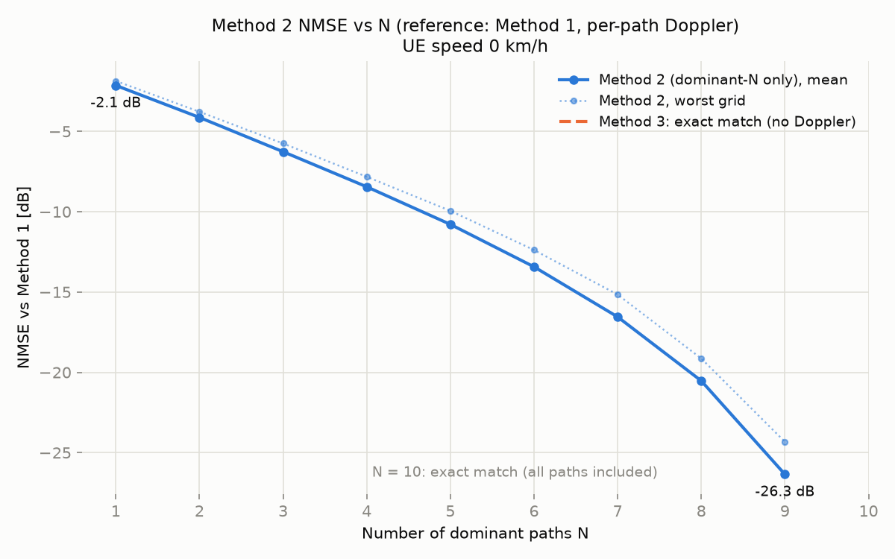
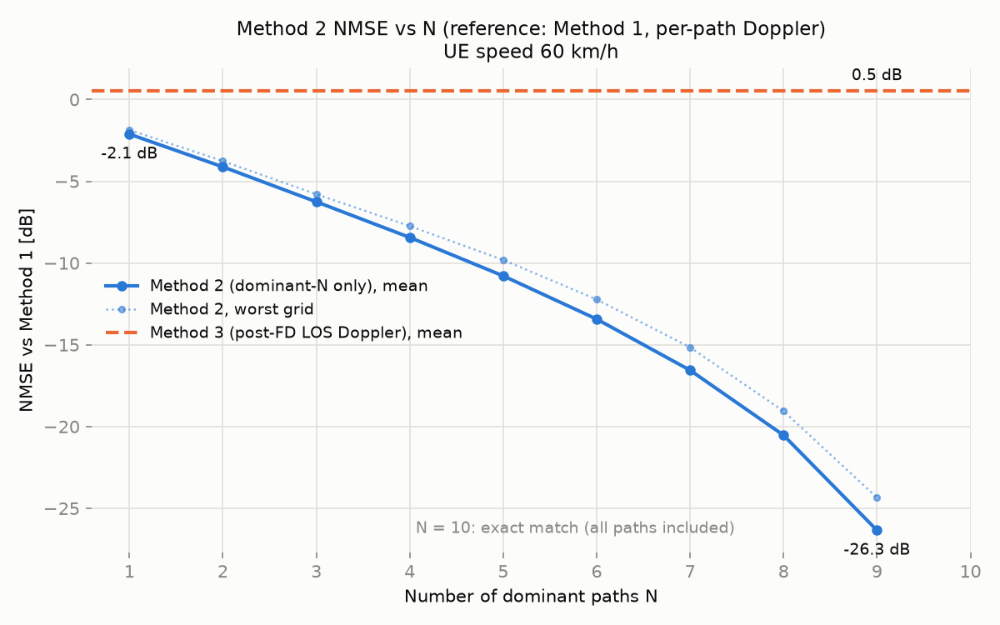
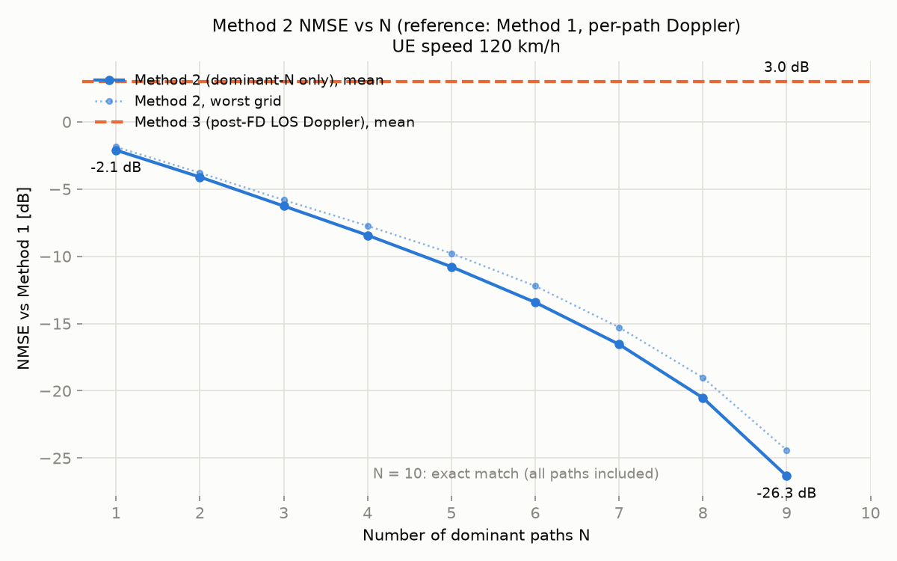

# Doppler 방식 비교 결과 (방식 1 기준 NMSE)

- 실험 일자: 2026-07-25, CI run [30149086893](https://github.com/csungq-eng/doppler_sim/actions/runs/30149086893)
- 입력 데이터: 가상 레이트레이싱 binary (per-antenna-pair 모드, grid 100개,
  BS 64 × UE 4, grid·pair당 path 3~10개(평균 6.5), seed 2026)
- OFDM: fc 3.5 GHz, SCS 15 kHz, subcarrier 3276개 → H는 64 × 4 × 3276
- 단말 이동성: 방향 45°, snapshot t = 1 ms, 속도 0 / 60 / 120 km/h
  (최대 Doppler: 0 / 194.6 / 389.2 Hz)
- 지표: **NMSE = ‖H_x − H₁‖² / ‖H₁‖²** — 방식 1(모든 path에 path별 Doppler
  적용)을 reference로 하며, 낮을수록 좋음. 표 값은 100개 grid 평균(dB).

## 방식 요약

| 방식 | 내용 |
|---|---|
| 1 (기준) | 각 path에 Doppler 적용 후 주파수 채널 변환 |
| 2 | power 상위 dominant N개 path만으로 채널 구성(나머지 제외) + path별 Doppler |
| 3 | Doppler 없이 주파수 변환 후, LOS 방향(BS→grid 상대 벡터를 AoA로 가정) 단일 Doppler로 전체 행렬 위상 회전 |

## 결과 표 (평균 NMSE [dB])

| N (방식 2) | v = 0 km/h | v = 60 km/h | v = 120 km/h |
|---|---|---|---|
| 1 | −2.14 | −2.12 | −2.11 |
| 2 | −4.13 | −4.12 | −4.10 |
| 3 | −6.26 | −6.26 | −6.26 |
| 4 | −8.45 | −8.43 | −8.43 |
| 5 | −10.79 | −10.79 | −10.78 |
| 6 | −13.43 | −13.43 | −13.42 |
| 7 | −16.55 | −16.56 | −16.54 |
| 8 | −20.53 | −20.53 | −20.52 |
| 9 | −26.35 | −26.34 | −26.33 |
| 10 | 정확히 일치* | 정확히 일치* | 정확히 일치* |
| **방식 3** | **정확히 일치** | **+0.55** | **+3.02** |

\* N = 10은 최대 path 수라 방식 2 == 방식 1 (−318 dB = 수치 오차 수준).
방식 3의 "정확히 일치"는 v = 0이면 Doppler 회전이 없어 방식 1과 같아지기 때문.

최악 grid 기준(최대 NMSE)도 경향은 동일: 방식 2는 평균보다 0.3~2 dB 높고,
방식 3은 60 km/h에서 +2.06 dB, 120 km/h에서 +3.32 dB.

## 곡선

| v = 0 km/h | v = 60 km/h | v = 120 km/h |
|---|---|---|
|  |  |  |

원본 수치: [img/nmse_sweep_v0.csv](img/nmse_sweep_v0.csv),
[v60](img/nmse_sweep_v60.csv), [v120](img/nmse_sweep_v120.csv)

## 해석

**방식 2의 NMSE는 속도와 사실상 무관하다 (세 열이 소수점 둘째 자리까지 거의
동일).** 이는 방식 2의 오차가 Doppler 근사가 아니라 **path 제외(truncation)
자체**에 지배된다는 뜻이다. 실제로 v = 0에서도(Doppler가 아예 없어도) NMSE가
그대로인데, 이때의 오차는 순수하게 버려진 path들의 전력이다. NMSE ≈ 제외된
전력 비율이라는 근사가 전 구간에서 성립한다 (예: N=3에서 하위 path들의 전력
합 평균 23.6% → −6.3 dB).

**방식 3의 오차는 속도에 비례해 커진다: 0 km/h(오차 0) → 60 km/h(+0.55 dB) →
120 km/h(+3.02 dB).** 방식 3은 t 동안 path별로 제각각 회전한 위상(각 path당
2π·f_d,p·t)을 단 하나의 LOS 방향 위상으로 보정하는데, 속도가 커질수록 회전량
자체가 커져(120 km/h, 1 ms에서 최대 0.39 사이클) 잘못된 방향의 보정이 채널을
더 크게 망가뜨린다. NMSE가 0 dB를 넘는 것은 "보정을 안 한 것보다 나쁘다"는
의미다.

**결론: 이 데이터에서는 N = 1(최강 path 하나)만으로도 방식 2가 방식 3을 모든
속도에서 능가한다.** 속도가 빠를수록 격차는 더 벌어진다.

### 주의: 가짜 데이터의 한계

현재 입력은 AoA가 전방위 uniform 랜덤이고 pair 간 독립인 가짜 데이터라서
방식 3에 최악의 조건이다 (LOS 가정과 채널이 무상관). 실제 레이트레이싱
결과라면:

- 첫 path의 AoA가 LOS 방향과 정렬 → 방식 3의 단일 위상 보정이 dominant 성분에
  대해서는 올바르게 작동 → 방식 3 개선
- 전력이 상위 3~4개 path에 집중(NLOS 잔여 전력 5% 미만도 흔함) → 방식 2의
  NMSE 하한이 −13 dB 이하로 내려감 → 방식 2도 개선

두 방식 모두 좋아지지만, 방식 3은 NLOS 성분의 이질적 Doppler를 원리적으로
표현할 수 없으므로 방식 2 우위라는 결론 자체는 유지될 것으로 예상된다.
정량 확인을 위해서는 Python 생성기의 AoA/전력 분포를 LOS 중심으로 바꿔
재실험하면 된다.

## 재현 방법

[USAGE.md](USAGE.md) 참조. 요약: push하면 CI가 세 속도의 sweep을 자동 실행하고
`doppler-results` artifact(CSV + PNG)를 업로드한다. 로컬 재현은:

```bash
./build/poc_doppler --binary output_per_pair/raytracing_result.bin \
    --speed-kmh 120 --direction-deg 45 --time-ms 1 --sweep-max 10 \
    --out-csv nmse_sweep_v120.csv
python plot_sweep.py nmse_sweep_v120.csv nmse_sweep_v120.png "UE speed 120 km/h"
```
